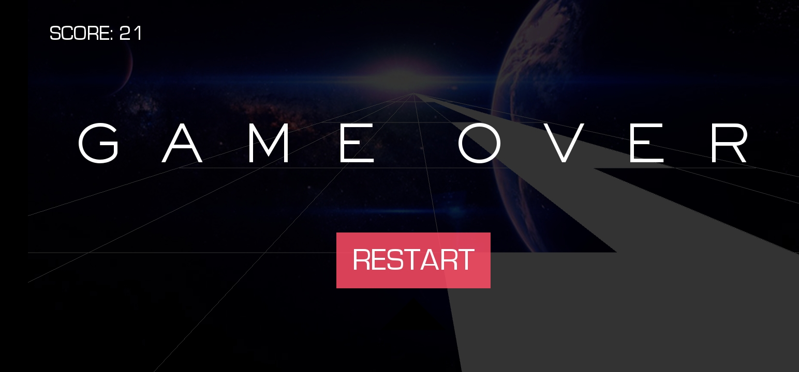

## Space Run App

**This is an android apllication that i have built using python and by taking help from some tutorial as python project**

## The App Look like:





> To run this application in your system:
```sh
# Make a seprate enivornment and install requirements
pip install -r requirements.txt

python main.py # App will start on the desktop


```
To get android app click on [link](https://drive.google.com/file/d/1t8FmDgd31XX3mcr61csV_QTHOyx1fjxs/view?usp=sharing)

Demo youtube video [link](https://www.youtube.com/watch?v=53eN27rmaUM)
